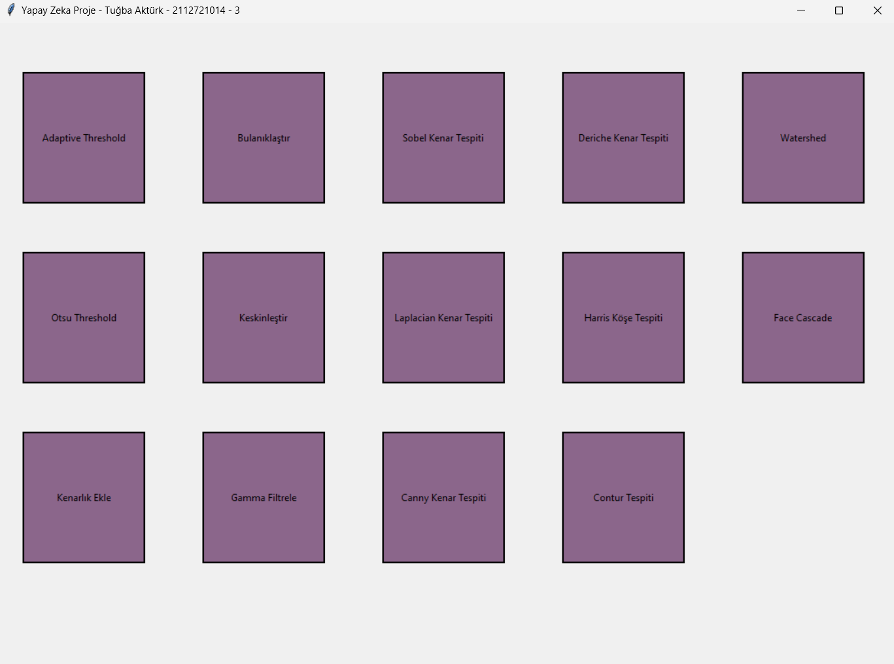
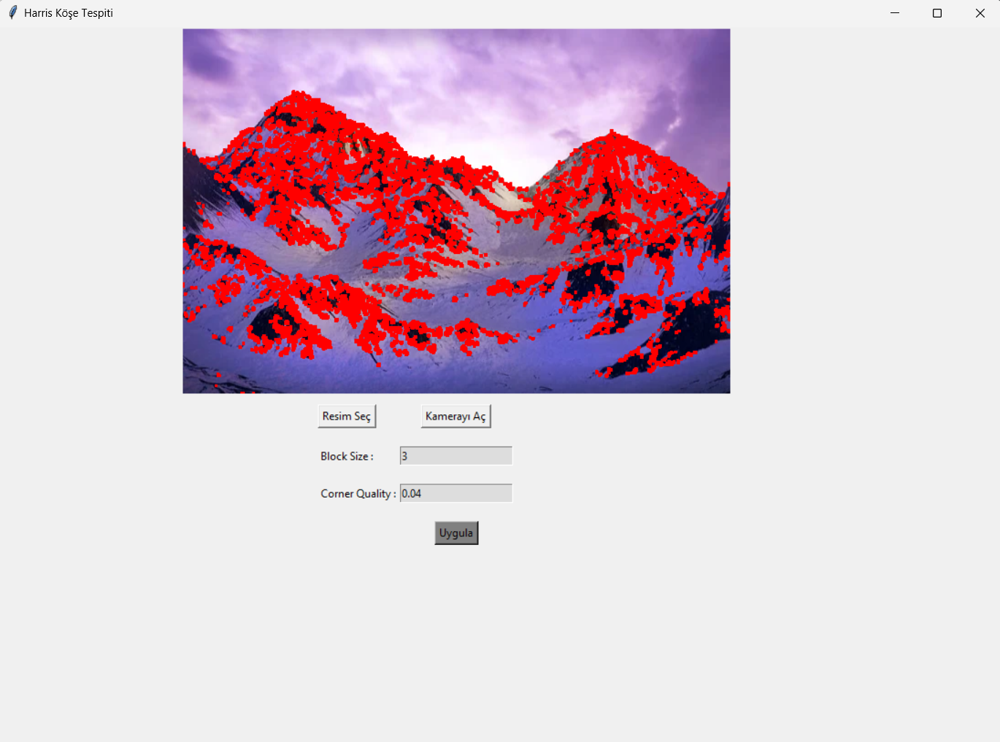

# Tkinter + OpenCV Görüntü İşleme Uygulaması

Bu proje, **Tkinter** arayüzü ile **OpenCV** kullanarak temel görüntü işleme algoritmalarını hem **resim dosyaları** hem de **web kamera** üzerinden denemenizi sağlayan basit bir demodur. Amaç; farklı filtreleri ve kenar/köşe tespit yöntemlerini parametreleriyle birlikte etkileşimli şekilde görmek ve öğrenmektir.

> Uygulama başlığı: `Yapay Zeka Proje - Tuğba Aktürk - 2112721014 - 3`

---

## 📸 Ekran Görüntüleri

**Ana Sayfa**
  


**Örnek İşlem Ekranı (Harris Köşe Tespiti)**
  


---

## ✨ Özellikler

Aşağıdaki modüller butonlar olarak ana ekranda yer alır. Her modül için **Resim Seç**, **Kamerayı Aç** ve varsa **parametre giriş alanları** bulunur.

- **Adaptive Threshold** (Mean-C)
- **Otsu Threshold**
- **Kenarlık Ekle** (`copyMakeBorder`)
- **Bulanıklaştır** (`blur`)
- **Keskinleştir** (`filter2D` ile özelleştirilebilir kernel)
- **Gamma Filtrele**
- **Sobel Kenar Tespiti**
- **Laplacian Kenar Tespiti**
- **Canny Kenar Tespiti**
- **Deriche Kenar Tespiti** (türev çekirdeklerinden türetilen basit yaklaşım)
- **Harris Köşe Tespiti**
- **Contour (Kontur) Tespiti**
- **Watershed Segmentasyon**
- **Face Cascade** (Haar cascade ile yüz algılama)

> Kamerayı açtığınız tüm modüllerde **q** tuşuna basarak pencereyi kapatabilirsiniz.

---

## 🧩 Mimari ve Akış

- Arayüz: **Tkinter**
- Görüntü işlemler: **OpenCV (cv2)** ve **NumPy**
- Görüntüyü Tkinter üzerinde göstermek: **Pillow (PIL)**
- Varsayılan gösterim resmi: `kuzeyIsiklari.jpg` (600x400’e ölçeklenmiş)
- Yardımcı dönüştürme fonksiyonları:
  - `convert_image(cv2_image)`: BGR→RGB çevirip `PhotoImage` döndürür.
  - `convert_image_second_variation(image)`: `np.uint8` dizi → `PhotoImage` (gri/tek kanallı çıktılar için pratik).

---

## 🛠 Gereksinimler

- **Python** 3.9+
- **OpenCV** `opencv-python`
- **Pillow** `Pillow`
- **NumPy** `numpy`
- (İsteğe bağlı) **matplotlib**: bazı denemeler için eklenmiştir.

Kurulum (Windows/macOS/Linux):
```bash
pip install opencv-python Pillow numpy matplotlib
```

> Tkinter, çoğu Python dağıtımıyla birlikte gelir. Sisteminizde yoksa işletim sisteminize göre ayrıca kurmanız gerekebilir.

---

## ▶️ Çalıştırma

1. Depoyu/klasörü yerel makinene alın.
2. Klasör içinde komut satırını açın.
3. Uygulamayı başlatın:
   ```bash
   python app.py
   ```
4. Ana ekrandan istediğiniz modüle tıklayın.
5. **Resim Seç** ile dosyadan, **Kamerayı Aç** ile webcam’den canlı olarak deneyin.
6. Varsa **parametreleri** girip **Uygula** butonuna basın.

---

## 🔧 Parametreler Hakkında Kısa Notlar

- **Adaptive Threshold**
  - `Max Value`: Eşik üstü piksel değeri (genelde 255).
  - `Block Size`: Yerel pencere boyutu (tek sayı olmalı, ör. 11, 15).
  - `C`: Ortalama/gauss ortalamasından çıkarılan sabit.
- **Otsu Threshold**
  - `Thresh` ve `Max Value` alanları bulunur; Otsu otomatik eşik belirler.
- **Bulanıklaştır**
  - `Kernel Size`: (k,k) boyutu (tek sayı tavsiye edilir).
- **Keskinleştir**
  - `Kernel`: merkez katsayı; daha büyük değerler daha agresif keskinlik verebilir.
- **Gamma Filtrele**
  - `Gamma`: <1 parlaklığı artırır, >1 koyulaştırır (uygulamadaki mantık normalleştirme ile yapılır).
  - `Max Value`: 255 tipik.
- **Sobel/Laplacian/Canny**
  - Kenar çıkarımı için `kernel/threshold` değerleri görselin gürültüsüne göre ayarlanmalıdır.
- **Harris Köşe Tespiti**
  - `Block Size` ve `Corner Quality (k)` değerleri köşe algılamayı etkiler.
- **Contour Tespiti**
  - Canny `low/high threshold` değerleri kontur sayısını ve kalitesini belirler.
- **Watershed**
  - Morfolojik açma, arkaplan/önplan ayrımı ve `distance transform` ile marker tabanlı segmentasyon yapılır.
- **Face Cascade**
  - `haarcascade_frontalface_default.xml` kullanılır; aydınlatma ve ölçek, sonucu etkiler.

---

## 📝 Bilinen Notlar / İpuçları

- Webcam modlarında pencereyi kapatmak için **q** tuşunu kullanın.
- Bazı algoritmalar gri seviye (tek kanal) üzerinde çalışır; arayüz görüntüyü otomatik dönüştürür.
- Farklı çözünürlüklerde çalışmak performans ve çıktı kalitesini etkiler (ör. `600x400` hızlı bir denge sağlar).

---

## 🗺 Yol Haritası (İsteğe Bağlı)

- Parametre giriş alanlarında **varsayılan değerlere** yer vermek
- Modülleri sınıflara ayırarak kodu **modüler** hale getirmek
- **Gerçek Deriche** filtresine daha doğru parametrik yaklaşım eklemek
- **Kaydet** butonu ile çıktı görselleri diske aktarma
- Basit bir **test görselleri** klasörü eklemek

## 👩‍💻 Author
**Tuğba Aktürk**  
Computer Engineering Student | Junior Software Developer
